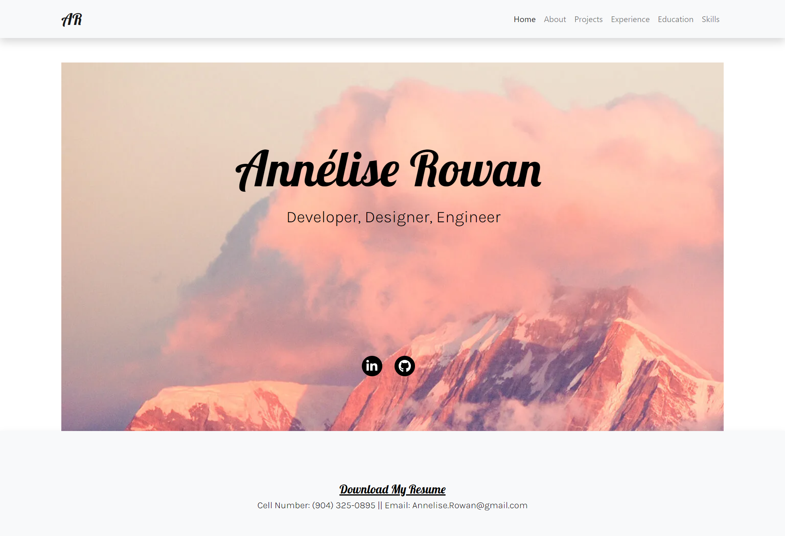
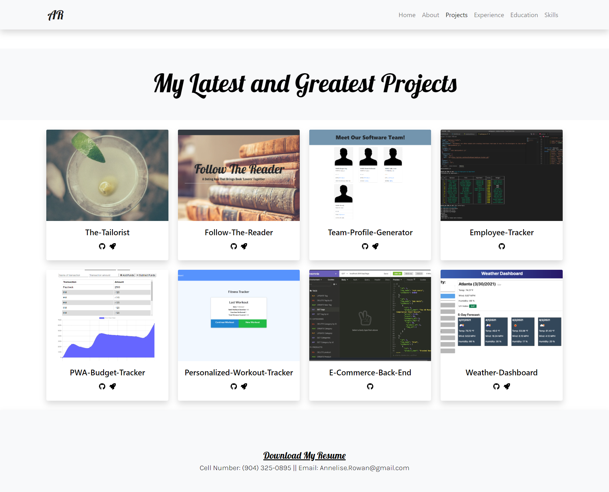
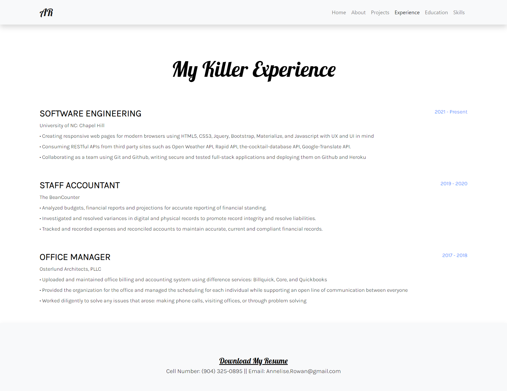

# React Portfolio

## Owned By

Annelise Rowan

## About

Created a React Portfolio not only to share projects while applying for jobs or working as a freelancer but also to share work with other developers and collaborate on projects. This is a single-page application to view work samples. There is an About section, a Project section, a Contact form, and a link to download a current Resume. 

## Preview

### Welcome to Annelise Rowan's Portfolio:

### Get to Know Me:

### My Latest and Greatest Projects:

### My Killer Experience:

### The Education Station:

### My Changing and Growing Skillset:

## Deployed Site

* [Github Pages Deployed Site](https://anneliserowan.github.io/react-portfolio/)
